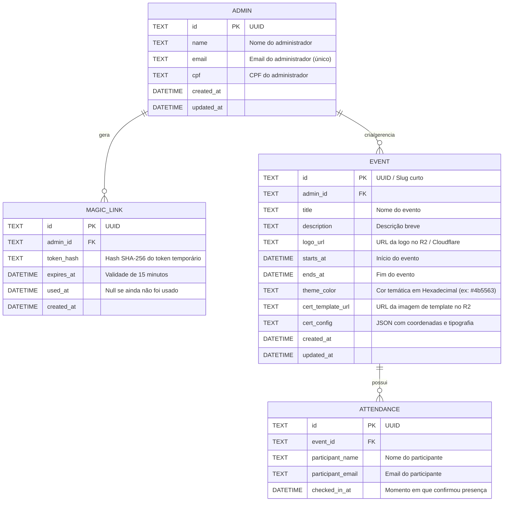

# Modelo do Banco de Dados - Vellum

Este documento descreve a modelagem relacional do banco de dados (projetado para **Cloudflare D1 / SQLite**), alinhada aos requisitos de simplicidade, autenticação por *Magic Link* e conformidade com a LGPD (sem armazenamento do CPF de participantes).

---

## 1. Visão Geral das Entidades



---

## 2. Esquema DDL (SQLite / Cloudflare D1)

```sql
-- Habilita integridade referencial
PRAGMA foreign_keys = ON;

-- 1. Administradores
CREATE TABLE IF NOT EXISTS admins (
    id TEXT PRIMARY KEY,
    name TEXT NOT NULL,
    email TEXT NOT NULL UNIQUE COLLATE NOCASE,
    cpf TEXT NOT NULL,
    created_at DATETIME NOT NULL DEFAULT CURRENT_TIMESTAMP,
    updated_at DATETIME NOT NULL DEFAULT CURRENT_TIMESTAMP
);

CREATE UNIQUE INDEX IF NOT EXISTS idx_admins_email ON admins(email);

-- 2. Tokens de Magic Link para Login
CREATE TABLE IF NOT EXISTS magic_links (
    id TEXT PRIMARY KEY,
    admin_id TEXT NOT NULL,
    token_hash TEXT NOT NULL UNIQUE,
    expires_at DATETIME NOT NULL,
    used_at DATETIME,
    created_at DATETIME NOT NULL DEFAULT CURRENT_TIMESTAMP,
    FOREIGN KEY (admin_id) REFERENCES admins(id) ON DELETE CASCADE
);

CREATE INDEX IF NOT EXISTS idx_magic_links_hash ON magic_links(token_hash);
CREATE INDEX IF NOT EXISTS idx_magic_links_admin_id ON magic_links(admin_id);

-- 3. Eventos
CREATE TABLE IF NOT EXISTS events (
    id TEXT PRIMARY KEY,
    admin_id TEXT NOT NULL,
    title TEXT NOT NULL,
    description TEXT,
    logo_url TEXT,
    theme_color TEXT NOT NULL DEFAULT '#4b5563', -- Cor temática customizada (hex)
    starts_at DATETIME NOT NULL,
    ends_at DATETIME NOT NULL,
    cert_template_url TEXT NOT NULL,
    cert_config TEXT NOT NULL, -- JSON estruturado
    created_at DATETIME NOT NULL DEFAULT CURRENT_TIMESTAMP,
    updated_at DATETIME NOT NULL DEFAULT CURRENT_TIMESTAMP,
    FOREIGN KEY (admin_id) REFERENCES admins(id) ON DELETE CASCADE
);

CREATE INDEX IF NOT EXISTS idx_events_admin_id ON events(admin_id);
CREATE INDEX IF NOT EXISTS idx_events_dates ON events(starts_at, ends_at);

-- 4. Lista de Presença dos Participantes
CREATE TABLE IF NOT EXISTS attendances (
    id TEXT PRIMARY KEY,
    event_id TEXT NOT NULL,
    participant_name TEXT NOT NULL,
    participant_email TEXT NOT NULL COLLATE NOCASE,
    checked_in_at DATETIME NOT NULL DEFAULT CURRENT_TIMESTAMP,
    FOREIGN KEY (event_id) REFERENCES events(id) ON DELETE CASCADE,
    UNIQUE (event_id, participant_email)
);

CREATE INDEX IF NOT EXISTS idx_attendances_event_id ON attendances(event_id);
```

---

## 3. Detalhamento e Decisões de Arquitetura

### A. Tabela `admins`
- **Por que reter o CPF do Admin?** O administrador é responsável legal pela criação do evento e emissão de certificados acadêmicos/profissionais.
- **`email`**: Utilizado para disparar os links de acesso seguro (Magic Link).

### B. Tabela `magic_links`
- Ao requisitar login, um token aleatório (ex: 32 bytes criptograficamente seguros) é gerado e seu hash SHA-256 é salvo em `token_hash`.
- Validade recomendada: **15 minutos**.
- Uma vez clicado, `used_at` é preenchido para evitar reutilização (*single-use token*).
- Pode-se emitir um JWT / cookie de sessão simples para manter o admin autenticado por X dias.

### C. Tabela `events`
- **`theme_color`**: Código hexadecimal (ex: `#4b5563`, `#1e3a8a`, `#15803d`) que personaliza a identidade visual da página do participante (botões, detalhes, foco e cabeçalhos sutis), mantendo o restante da interface em tons neutros de cinza.
- **`cert_config`** (formato JSON): Armazena as coordenadas e estilo para renderização client-side do certificado.
  ```json
  {
    "name_field": {
      "x": 400,
      "y": 620,
      "font_size": 32,
      "font_family": "Helvetica",
      "color": "#111827",
      "align": "center"
    },
    "cpf_field": {
      "x": 400,
      "y": 670,
      "font_size": 18,
      "font_family": "Helvetica",
      "color": "#4b5563",
      "align": "center"
    },
    "date_field": {
      "x": 750,
      "y": 980,
      "font_size": 14,
      "font_family": "Helvetica",
      "color": "#6b7280",
      "align": "right"
    }
  }
  ```

### D. Tabela `attendances` (LGPD por Design)
- **Privacidade do Participante:** O **CPF não é gravado** nesta tabela.
  - O participante digita o CPF no navegador;
  - O navegador gera o certificado em PDF/Imagem via `pdf-lib`/`Canvas` contendo o CPF localmente;
  - O navegador envia para a API apenas `participant_name` e `participant_email`;
  - O banco de dados nunca armazena o CPF do aluno/participante, eliminando risco de vazamento de dados fiscais/sensíveis na nuvem.
- **Prevenção de duplicidade:** `UNIQUE(event_id, participant_email)` garante que um mesmo participante não duplique a presença no mesmo evento.
