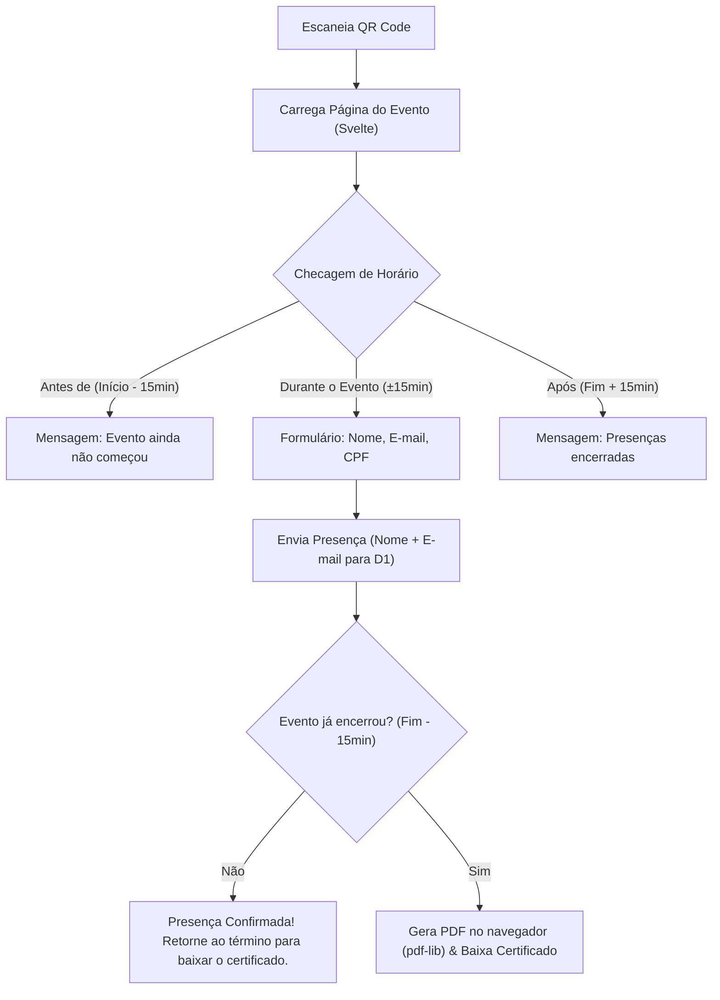

# Design Bible - Vellum

> **Conceito & Filosofia:**  
> Inspirado na sobriedade de publicações editoriais e papéis impressos (o próprio nome *Vellum* remete a pergaminho de alta qualidade). A interface prioriza clareza tipográfica, elegância acadêmica, ausência de ruídos visuais e foco absoluto na tarefa imediata.

---

## 1. Regra de Ouro: Filosofia Anti-Card (Sem Caixas / Sem Cards)

Interfaces modernas frequentemente abusam de cartões flutuantes (`cards`) com sombras, bordas arredondadas grossas e elevações exageradas que poluem a tela, especialmente em dispositivos móveis.

**No Vellum é expressamente evitado o padrão de cards:**
* ❌ **Não usar:** Caixas brancas flutuantes com sombras (`shadow-lg`, `rounded-xl`, fundos cinzas destacados).
* ❌ **Não empilhar:** Vários cards individuais para listar participantes ou itens.
* ✅ **Usar:** Hierarquia puramente tipográfica, respiros generosos de espaçamento vertical (`margin` e `padding`), e divisores horizontais ultrafinos (*hairlines* de 1px).
* ✅ **Estrutura:** As seções fluem naturalmente como as páginas de um livro ou artigo bem diagramado, separadas por títulos serifados marcantes e linhas sutis.

---

## 2. Tipografia

A identidade visual é conduzida pelo contraste harmônico entre uma **Serif Moderna e Expressiva** para títulos e uma **Sans-serif Neutra** de alta legibilidade para leitura e formulários.

### Famílias Tipográficas
1. **Títulos e Cabeçalhos (Display & Headings):**
   * **Fonte:** `Newsreader` ou `Playfair Display` (Serif).
   * **Propósito:** Expressar autoridade, solenidade acadêmica e refinamento editorial.
   * **Pesos:** 400 (Regular para títulos grandes elegantes) e 600 (Semibold para seções).

2. **Interface, Formulários e Textos Corridos:**
   * **Fonte:** `Inter` ou sistema nativo sans-serif (`system-ui, -apple-system, sans-serif`).
   * **Propósito:** Máxima legibilidade em telas pequenas, formulários sem ambiguidades.
   * **Pesos:** 400 (Normal), 500 (Médio para labels e botões).

3. **Dados Numéricos, Horários e Código:**
   * **Fonte:** `JetBrains Mono` ou `ui-monospace`.
   * **Propósito:** Exibição precisa de datas, horários, CPFs e contadores da lista.

### Escala de Tamanhos
| Nível | Família | Tamanho / Line-Height | Uso |
| :--- | :--- | :--- | :--- |
| **Hero / H1** | Serif | `2.25rem (36px)` / `1.15` | Nome do evento na página do participante |
| **H2** | Serif | `1.75rem (28px)` / `1.2` | Títulos principais do painel de administração |
| **H3** | Serif | `1.25rem (20px)` / `1.3` | Seções (ex: "Lista de Presença", "Configuração") |
| **Body** | Sans | `1.0rem (16px)` / `1.5` | Textos descritivos, orientações e avisos |
| **Small / Meta** | Sans | `0.875rem (14px)` / `1.4` | Labels de input, status, texto auxiliar LGPD |
| **Monospace** | Mono | `0.875rem (14px)` / `1.2` | Horários (`19:00 - 22:00`), contadores de alunos |

---

## 3. Paleta de Cores & Sistema Temático Dinâmico

A base da interface é monocromática e neutra. A vida visual de cada evento vem da sua **Cor Temática (`theme_color`)**, configurada pelo administrador no cadastro do evento e injetada via CSS Variables.

### 3.1. Base Monocromática (Grayscale Neutro)

```css
:root {
  --bg-primary: #fafafa;         /* Fundo da aplicação (off-white quente) */
  --bg-surface: #ffffff;         /* Fundo de campos e áreas de leitura */
  --border-hairline: #e4e4e7;    /* Divisórias ultrafinas (Zinc 200) */
  --border-focus: #71717a;       /* Foco neutro (Zinc 500) */
  --text-primary: #18181b;       /* Título e textos principais (Zinc 900) */
  --text-muted: #71717a;         /* Metadados, subtítulos e labels (Zinc 500) */
  --text-subtle: #a1a1aa;        /* Placeholders e divisores (Zinc 400) */
}
```

### 3.2. Cor Temática Dinâmica do Evento (`--event-theme`)

Cada evento possui uma cor hexadecimal única salva no banco de dados (ex: `#1e3a8a` Azul Real, `#065f46` Esmeralda, `#831843` Borgonha, ou o padrão neutro `#3f3f46` Grafite).

No Svelte, a cor é aplicada no elemento raiz da página do evento:
```svelte
<main style="--event-theme: {event.theme_color};">
```

#### Regras de Aplicação da Cor Temática:
* **Botão Primário de Ação (CTA):** Preenchimento na cor `--event-theme` com texto calculado em branco ou preto de alto contraste.
* **Linha de Destaque Editorial:** Fita sutil de 2px no topo da página ou abaixo do título principal.
* **Estados de Foco:** O anel de foco dos inputs (`focus:ring-[var(--event-theme)]`).
* **Tags e Badges de Status:** Fundo suave transparente com texto na cor temática (`color: var(--event-theme)`).
* **Marcador de Coordenadas do Certificado:** O pino/mira na prévia do template.

---

## 4. Diretrizes de Layout e Componentes

### 4.1. Layout Mobile-Friendly (Primeiro no Celular)
O participante estará de pé em uma sala de aula ou auditório, segurando o celular em uma mão e com conexão 4G/3G.

* **Área de Toque Generosa:** Todo campo de input e botão tem altura mínima de **48px**.
* **Uma Coluna Limpa:** No celular, a leitura é estritamente vertical, sem grids truncados.
* **Teclados Virtuais Otimizados:**
  * Nome: `autocomplete="name"` `autocapitalize="words"`
  * E-mail: `type="email"` `autocomplete="email"` `inputmode="email"`
  * CPF: `type="text"` `inputmode="numeric"` `pattern="[0-9]*"` com máscara automática (`000.000.000-00`).

### 4.2. Formulários no Estilo Anti-Card
Em vez de encapsular o formulário dentro de uma caixa branca:
* Os campos são integrados diretamente ao fundo da página.
* Bordas simples, limpas e sem relevo:
  ```html
  <div class="space-y-1">
    <label class="block text-xs uppercase tracking-wider text-neutral-500 font-sans">
      Nome Completo
    </label>
    <input 
      type="text" 
      class="w-full h-12 bg-white px-3 border border-neutral-300 rounded-none focus:outline-none focus:border-[var(--event-theme)] font-sans text-base transition-colors"
      placeholder="Como sairá no seu certificado" 
    />
  </div>
  ```

### 4.3. Lista de Presença do Administrador (Minimalista & Eficiente)
Em vez de cards para cada aluno:
* Tabela aberta com divisores horizontais discretos (`border-b border-neutral-200`).
* Exibição limpa:
  ```
  NOME DO PARTICIPANTE          E-MAIL                     HORÁRIO
  ───────────────────────────────────────────────────────────────────
  Ana Beatriz Silveira          ana.silveira@usp.br        19:14:02
  Carlos Eduardo Mendes         cadu.mendes@gmail.com      19:15:33
  ```
* Barra de topo contendo apenas:
  1. Contador (`42 presenças confirmadas`).
  2. Botão simples com contorno: `[ Exportar .CSV ]`.

### 4.4. Seletor de Coordenadas do Certificado
* A imagem do template é exibida em proporção real com suporte a zoom/scroll em telas menores.
* O administrador clica ou toca na imagem onde deseja posicionar o **Nome** e o **CPF**.
* Um marcador minimalista com retículo (*crosshair*) estilizado na cor temática mostra a posição exata em pixels $(x, y)$.
* Controles simplificados abaixo da imagem para ajustar tamanho da fonte (slider numérico de 12px a 48px).

---

## 5. Estados e Fluxos do Participante



---

## 6. Micro-interações e Acessibilidade (A11y)

1. **Feedback Visual Imediato:**
   * Estados de carregamento com *skeleton loaders* suaves em tons de cinza claro (sem spinners espalhafatosos).
   * Mensagens de sucesso com ícones em traço fino (stroke 1.5px).
2. **Contraste & Acessibilidade:**
   * Relação de contraste mínima de 4.5:1 para todo texto corrido sobre o fundo cinza/off-white.
   * Quando o botão adotar a `--event-theme`, a cor do texto do botão é calculada dinamicamente (branco se a cor de fundo for escura, preto se for clara).
3. **Privacidade Visível:**
   * Abaixo do campo CPF, incluir uma nota em cinza discreto:
     > *"Seu CPF é processado localmente apenas para gerar seu certificado e nunca é salvo em nossos servidores."*
