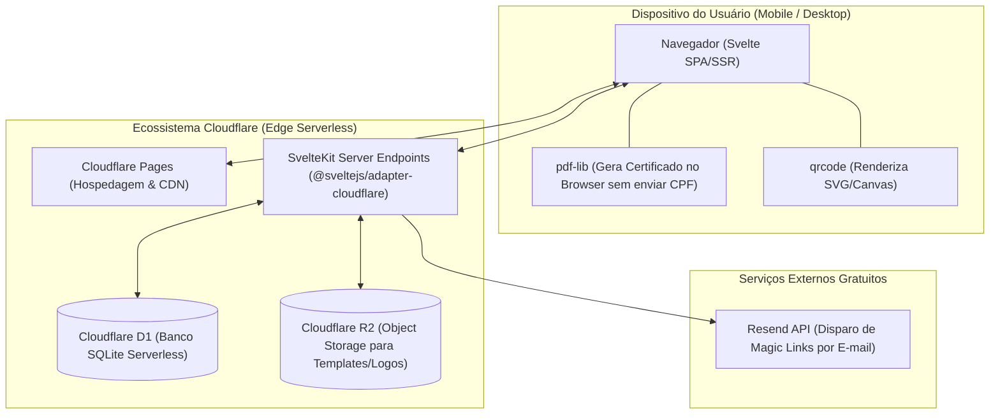
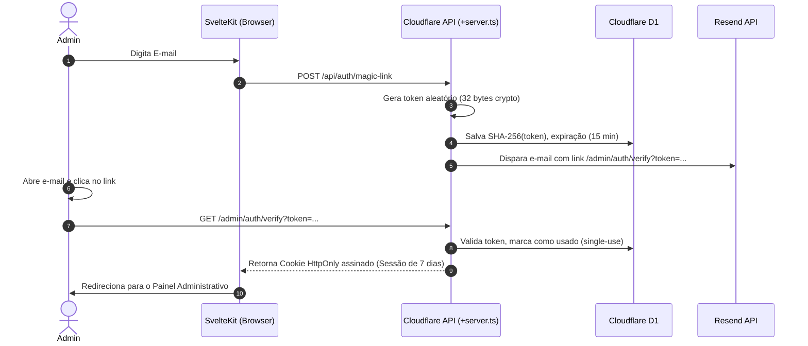

# Stack Bible - Vellum

Este documento formaliza as decisões de arquitetura e tecnologia adotadas no **Vellum**. O objetivo primordial é manter o projeto com o **menor custo operacional possível (R$ 0,00)**, **zero servidores dedicados para gerenciar**, **carregamento ultrarrápido em redes móveis** e **alta facilidade de manutenção**.

---

## 1. Visão Geral da Arquitetura



---

## 2. Matriz de Tecnologias

| Camada | Tecnologia | Pacote / Versão | Justificativa |
| :--- | :--- | :--- | :--- |
| **Framework Fullstack** | SvelteKit | `svelte@^5`, `@sveltejs/kit@^2` | Compilação sem Virtual DOM (bundle minúsculo no 4G), reatividade nativa e rotas SSR/API unificadas. |
| **Adaptador Cloudflare** | Cloudflare Adapter | `@sveltejs/adapter-cloudflare` | Integração de primeira classe com Pages Functions, D1 e R2 via objeto `platform.env`. |
| **Banco de Dados** | Cloudflare D1 | Nativo (SQLite) | Banco relacional serverless, gratuito, sem gerenciamento de portas, conexões ou servidores. |
| **Armazenamento de Arquivos** | Cloudflare R2 | Nativo (S3-compatible) | Guarda logos e templates de certificados com tráfego de saída gratuito (*zero egress*). |
| **Estilização** | Tailwind CSS | `tailwindcss@^4` (ou `^3.4`) | CSS utilitário enxuto, sem runtime, facilidade para implementar o tema editorial e variáveis CSS. |
| **Emissão de Certificados** | `pdf-lib` | `pdf-lib@^1.17` | Desenha o texto do certificado diretamente no navegador do participante. Zero CPU no servidor e CPF protegido. |
| **Geração de QR Code** | `qrcode` | `qrcode@^1.5` | Gera QR Codes em formato SVG/Canvas diretamente no navegador do administrador. |
| **Disparo Transacional** | Resend | Chamada nativa `fetch` | Envio de Magic Links sem dependência pesada de SDK; camada gratuita de até 3.000 e-mails/mês. |
| **Validação de Dados** | Zod | `zod@^3.23` | Validação estrita de schemas em formulários e APIs TypeScript. |

---

## 3. Frontend: SvelteKit + Tailwind CSS

### 3.1. Por que SvelteKit em vez de React/Next.js?
1. **Performance em Redes Móveis (QR Code no 4G/3G):**
   * O participante escaneia o QR Code em pé na sala de aula.
   * Enquanto um bundle mínimo do React com runtime pesa >130 KB gzipped, o Svelte compila componentes para JavaScript cirúrgico puro, pesando frequentemente menos de **25 KB**. O formulário abre quase instantaneamente.
2. **Reatividade Direta no Seletor de Coordenadas:**
   * No painel do administrador, ao clicar sobre a imagem do certificado para definir o ponto $(x, y)$, o Svelte lida com coordenadas via bindings diretos (`bind:this`, eventos de ponteiro nativos), sem a necessidade de sincronizar estados complexos com `useEffect`.

### 3.2. Estratégia de Renderização
* **Rotas Públicas do Participante (`/e/[eventId]`):** SSR com hidratação rápida para renderizar o nome do evento e a folha de estilos instantaneamente.
* **Painel Administrativo (`/admin/*`):** Protegido por middleware de sessão, com carregamento reativo de dados tabulares.

---

## 4. Backend: Cloudflare Edge Runtime

Toda a lógica de backend opera diretamente nas **Cloudflare Pages Functions** através do `@sveltejs/adapter-cloudflare`.

### 4.1. Acesso aos Recursos Cloudflare no SvelteKit
No arquivo `src/routes/api/.../+server.ts`, os serviços são acessados diretamente através do contexto da plataforma:
```typescript
import type { RequestHandler } from './$types';

export const POST: RequestHandler = async ({ request, platform }) => {
  const db = platform?.env.DB; // Instância do Cloudflare D1
  const r2 = platform?.env.R2; // Bucket do Cloudflare R2
  
  // Queries SQL preparadas nativas e seguras contra injeção SQL
  const result = await db.prepare('SELECT * FROM events WHERE id = ?').bind(eventId).first();
  
  return new Response(JSON.stringify(result), { headers: { 'Content-Type': 'application/json' } });
};
```

---

## 5. Autenticação: Magic Links & Sessões

A autenticação é exclusiva para administradores e não requer senhas:



### Regras de Segurança do Cookie de Sessão:
* `HttpOnly: true` (inalcançável via scripts maliciosos no navegador / anti-XSS).
* `Secure: true` (trafega exclusivamente sobre HTTPS).
* `SameSite: Lax` (proteção nativa contra ataques CSRF).

---

## 6. Integridade, Anti-Fraude e LGPD

### 6.1. Validação de Janela Temporal de Presença
A presença **NÃO** depende apenas do relógio do celular do participante. A verificação é obrigatória no servidor:
```typescript
const now = new Date().getTime();
const startTolerance = new Date(event.starts_at).getTime() - (15 * 60 * 1000); // -15 min
const endTolerance = new Date(event.ends_at).getTime() + (15 * 60 * 1000);     // +15 min

if (now < startTolerance) {
  return error(400, "O evento ainda não iniciou o credenciamento.");
}
if (now > endTolerance) {
  return error(400, "O período de registro de presença para este evento expirou.");
}
```

### 6.2. Liberação do Certificado
* Apenas liberado se `now >= (new Date(event.ends_at).getTime() - 15 * 60 * 1000)`.
* Se o participante tentar emitir antes, a interface exibe aviso elegante informando o horário previsto para download.

### 6.3. Proteção contra Injeção de Fórmulas no CSV (CSV Injection)
Para evitar que planilhas executem comandos maliciosos quando o administrador abrir o `.csv` no Excel, todos os campos de texto passam por um sanitizador:
```typescript
export function sanitizeCsvField(val: string): string {
  if (/^[=+@-]/i.test(val)) {
    return `'${val}`; // Adiciona apóstrofo para forçar o Excel a tratar como texto puro
  }
  return val;
}
```

### 6.4. LGPD & Isolamento do CPF
* O campo CPF **nunca é transmitido para a rota de presença**.
* A biblioteca `pdf-lib` recebe o CPF em memória no navegador, mescla o texto com a imagem obtida do R2 e oferece o blob gerado para download imediato.

---

## 7. Estrutura de Diretórios Recomendada

```
vellum/
├── migrations/                     # Scripts SQL para o Cloudflare D1
│   └── 0001_initial_schema.sql
├── src/
│   ├── lib/
│   │   ├── components/             # Componentes Svelte (estilo anti-card)
│   │   │   ├── CertificatePicker.svelte  # Seletor de coordenadas
│   │   │   ├── FormField.svelte          # Input 48px minimalista
│   │   │   └── Header.svelte
│   │   ├── server/                 # Lógica de servidor (Node/Edge)
│   │   │   ├── auth.ts             # Magic link & validação de cookies
│   │   │   ├── db.ts               # Helpers para o D1
│   │   │   └── email.ts            # Integração com Resend via fetch
│   │   └── utils/
│   │       ├── certificate.ts      # Engine pdf-lib (roda no cliente)
│   │       └── csv.ts              # Sanitizador de CSV
│   └── routes/
│       ├── +layout.svelte          # Shell com fontes serifadas e layout base
│       ├── +page.svelte            # Landing/Apresentação minimalista
│       ├── admin/                  # Rotas do Administrador
│       │   ├── +page.svelte        # Dashboard (Lista de eventos)
│       │   ├── login/+page.svelte  # Solicitação de Magic Link
│       │   ├── auth/verify/+page.server.ts # Validação de token
│       │   └── events/
│       │       ├── new/+page.svelte        # Criação de evento + upload R2
│       │       └── [id]/+page.svelte       # Detalhes, Presença e CSV
│       ├── e/
│       │   └── [id]/               # Página do Participante (Acesso via QR Code)
│       │       └── +page.svelte
│       └── api/
│           ├── attendance/+server.ts # Registro de presença
│           └── export-csv/+server.ts # Download seguro do arquivo .csv
├── static/                         # Assets estáticos (fontes, favicon)
├── svelte.config.js                # Configuração com adapter-cloudflare
├── tailwind.config.ts              # Configuração com variáveis CSS e fontes
├── vite.config.ts                  # Vite Bundler
└── wrangler.toml                   # Bindings D1, R2 e configurações Cloudflare
```

---

## 8. Guia de Comandos e DevOps

| Ação | Comando |
| :--- | :--- |
| **Instalação das Dependências** | `pnpm install` |
| **Executar Ambiente Local** | `pnpm dev` |
| **Criar Banco D1 na Cloudflare** | `pnpm wrangler d1 create vellum-db` |
| **Rodar Migrações Localmente** | `pnpm wrangler d1 execute vellum-db --local --file=./migrations/0001_initial_schema.sql` |
| **Rodar Migrações em Produção** | `pnpm wrangler d1 execute vellum-db --remote --file=./migrations/0001_initial_schema.sql` |
| **Criar Bucket R2** | `pnpm wrangler r2 bucket create vellum-storage` |
| **Deploy para Cloudflare Pages** | `pnpm wrangler pages deploy` |
